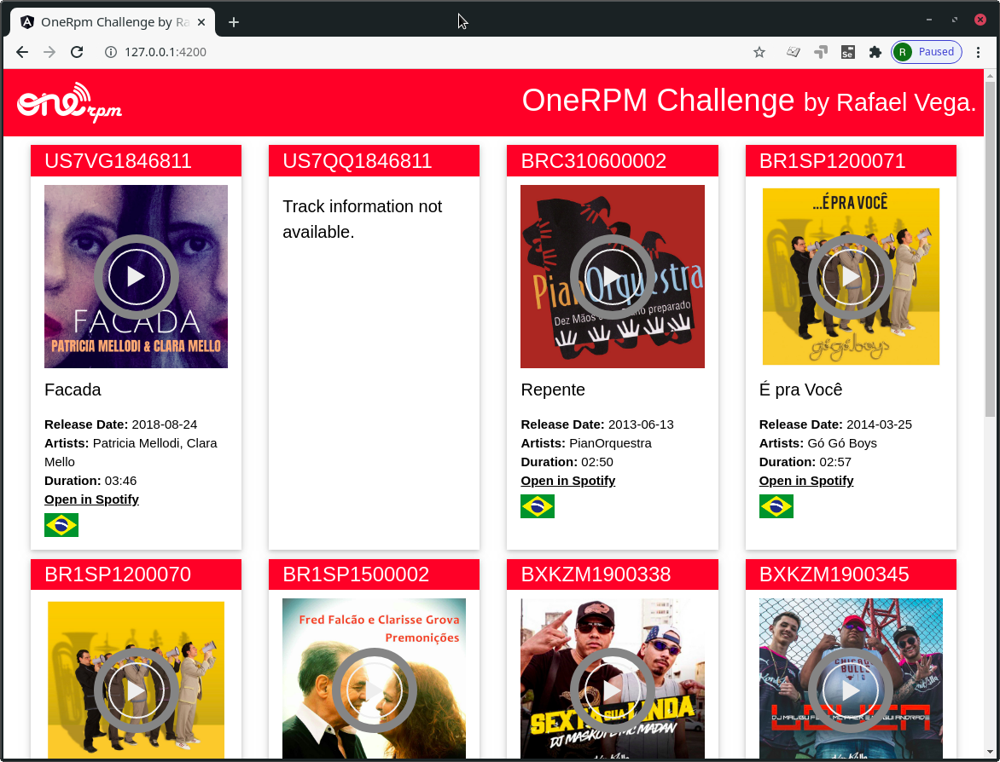

# Rafael Vega's Solution to OneRPM Full Stack Challenge

This is a web application that displays song metadata and plays audio previews for a list of songs. The metadata is searched in the Soptify Web API based on the songs ISRC numbers.



The application was implemented as two independent applications that communicate via HTTP in a RESTful fashion.

## Server side application

The server side application exposes a REST api that returns all the relevant meta-data for the songs. An example JSON response is listed below.

When a request is received, the MySQL database is queried to see if we already have the information for that song. If we dont't, we fetch the data from the Spotify Web API and store the information in the database for later use.

This was implemented using the Laravel PHP framework version 8 and a MySQL database. The most relevant files to read are:

* [server-side/tests/Feature/SongTest.php](server-side/tests/Feature/SongTest.php)
* [server-side/app/Models/SpotifySong.php](server-side/app/Models/SpotifySong.php)
* [server-side/database/migrations/2021_01_16_214324_create_songs_table.php](server-side/database/migrations/2021_01_16_214324_create_songs_table.php).
* [server-side/app/Http/Controllers/SongController.php](server-side/app/Http/Controllers/SongController.php)
* [server-side/app/Models/Song.php](server-side/app/Models/Song.php)
* [server-side/app/Models/SpotifySong.php](server-side/app/Models/SpotifySong.php)

### Running in a development environment

This has only been tested in an up-to date Arch Linux machine. cd into the `server-side` directory before running any of the commands below.

1. Install php and php composer in your system. In arch linux you can do `sudo pacman -S composer`.

1. Install dependencies. `composer install`

1. Create two MySQL databases. One should be called onerpmchallenge and onerpmchallenge_test

1. Make two copies of `.env.example` called `.env` and `.env.testing`. Edit those files and make sure you enter the database credentials correctly.

1. Run the database migrations `php artisan migrate`.

1. Run the server side application `php artisan serve`. You will get a message with the http url where the app will be exposed. Take note of this, you'll need it when setting up the client-side app.

1. Make sure the app is running by opening the url in the last point in a web browser.

1. Run the integration tests `php artisan test`

### API Documentation

Request: 

`GET /`

Response:

```json
[
  {
    "isrc": "US7VG1846811",
    "artists": "Patricia Mellodi, Clara Mello",
    "thumb": "https://i.scdn.co/image/ab67616d0000b273dec33cb3719a7430f8beee9b",
    "release_date": "2018-08-24",
    "title": "Facada",
    "duration": "03:46",
    "audio_preview": "https://p.scdn.co/mp3-preview/50a61e93510760f3d853f55231bbec76d04f274f?cid=2ba67ae1b86847f38c70ca85f90ededf",
    "spotify_link": "https://open.spotify.com/track/3bJ2MLOtyfpMMLyP5GGjES",
    "available_in_br": 1
  },
  {
    "isrc": "US7QQ1846811",
    "artists": "",
    "thumb": "",
    "release_date": "1970-01-01",
    "title": "Track Not Found",
    "duration": "00:00",
    "audio_preview": "",
    "spotify_link": "",
    "available_in_br": 0
  },
  // Other song objects ...
]
```

## Client side application

The client side application fetches data from the API exposed by the server-side app and displays it in a nice html interface that can be viewed in any modern web browser (it has only been tested in Google Chrome). It was built using Angular 11 and [w3-css](https://www.w3schools.com/w3css/defaulT.asp).

Relevant files to look at:

* [client-side/src/app/songs/songs.component.ts](client-side/src/app/songs/songs.component.ts)
* [client-side/src/app/songs/songs.component.html](client-side/src/app/songs/songs.component.html)
* [client-side/src/app/app.component.html](client-side/src/app/app.component.html)

### Running in a development environment

This has only been tested in an up-to date Arch Linux machine. cd into the `client-side` directory before running any of the commands below.

1. Install node and npm in your machine. In arch you can do `sudo pacman install nodejs npm`

1. Install angular-cli `npm install -g @angular/cli`

1. Install angular dependencies. `npm install`.

1. Edit the `src/environments/environment.ts` file and make sure the `api_url` value is correct.

1. Run the development server and take note of the url. Open the url in a web browser. `ng serve`

<hr/>

# Original OneRPM README:

## Início

Bem vindo ao mundo da música!

Atualmente temos a necessidade de consumir os dados de faixas musicais através do código ISRC, que é uma das coisas mais importantes na indústria fonográfica.

Segundo [Abramus](https://www.abramus.org.br/musica/isrc/), ISRC (International Standard Recording Code ou Código de Gravação Padrão Internacional) é um padrão internacional de código para identificar de forma única as gravações (faixas).

Ele funciona como um código de barras da faixa.


## Problema

Durante o fechamento de contrato com um produtor, foram informados 10 ISRC's que não constam em nossas bases de dados, que seguem abaixo:

* US7VG1846811
* US7QQ1846811
* BRC310600002
* BR1SP1200071
* BR1SP1200070
* BR1SP1500002
* BXKZM1900338
* BXKZM1900345
* QZNJX2081700
* QZNJX2078148

Precisamos obter e exibir os seguintes dados:

* Thumb do álbum
* Data de lançamento
* Título da faixa
* Lista dos artistas da faixa
* Duração da faixa em minutos e segundos (mm:ss)
* Player com prévia do áudio
* Link para a página da faixa no Spotify
* Sinalização dizendo se a faixa está ou não disponível no Brasil (BR)

Por decisão técnica, temos a necessidade de guardar estas informações em um banco de dados. Para isso, fique livre para criar a estrutura necessária para guardar as informações que achar pertinente das faixas.

Uma vez armazenados os dados, precisamos exibí-los através de uma webpage pública, ordenados por título da faixa de forma alfabética.


## Requisitos

* Faça um fork deste repositório e abra um PR quando estiver finalizado.
* O backend deve ser feito no framework Laravel 7.0 ou superior.
* O banco de dados deve ser MySQL.
* A página deve ser responsiva para atender todos os tipos de dispositivos.
* Use a API do Spotify: [https://developer.spotify.com/](https://developer.spotify.com/) para coletar os dados das faixas.


## Diferencial

* Desenvolver o frontend no Angular 8 ou superior.
* Desenvolver testes unitários e de integração.


## O que será avaliado

* Fidelidade às instruções.
* Padrões de projeto.
* Clean Code e boas práticas.
* Boas práticas de versionamento.


## Perfil que buscamos

* Comunicativo
* Autodidata
* Automotivado
* Curioso
* Gostar de trabalhar em equipe
* Compromissado
