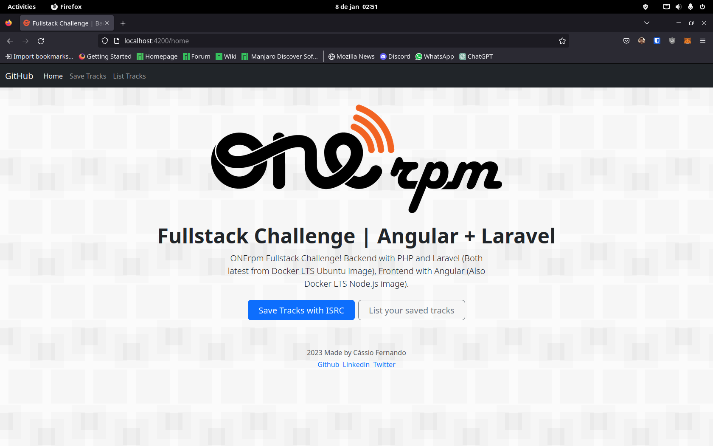

<h1 align="center">
  ONErpm Fullstack Challenge
</h1>

<h4 align="center">ONErpm Fullstack Challenge | Laravel + Angular</h4>

<p align="center">
  <a href="#about">About</a> •
  <a href="#features">Features</a> •
  <a href="#usage">Usage</a> •
  <a href="#credits">Credits</a> •
  <a href="#license">License</a> •
  <a href="#statement">Statement</a>
</p>



## About

This project for applying as Fullstack developer at ONErpm. As required, the backend is on Laravel on +7 version and Angular on +8 version, this project also uses MySQL as database.

## Features

Frontend demo on (Backend features will not work ):
[https://onerpm-full-stack-challenge.vercel.app/home](https://onerpm-full-stack-challenge.vercel.app/home)

- Search tracks on Spotify with ISRC
- See info about the track
  - Album thumb
  - Release date
  - Track title
  - Artists list
  - Track duration
  - Preview player
  - Spotify page link
  - BR avaiable signal
- Save a track to database
- Get all your saved tracks
- Delete a track from database
- Frontend
  - Angular routing
  - Popup service
    - See if you actions were really done
    - Check if you really want to delete it
- Backend
  - Track and Artist many to many relation
  - Transaction
  - API docs on ``request-docs/``

### Docker Containers

- db: MySQL latest image
- adminer: Adminer latest image to check the database
- backend: Custom ubuntu lts made to run Laravel
- Frontend: NodeJS lts image


## Usage

You only need to setup [docker](https://www.docker.com/)! From your terminal:

```sh
git clone https://github.com/cassiofb-dev/full-stack-challenge

cd full-stack-challenge

docker compose up -d
```

- To see the frontend ``localhost:4200``
- To see backend docs ``localhost:8000/request-docs/``
- To see the mysql database ``localhost:8080``

## Credits

This project uses git, docker, angular, laravel, mysql and lots of open source projects.

---

## Statement

### Início

Bem vindo ao mundo da música!

Atualmente temos a necessidade de consumir os dados de faixas musicais através do código ISRC, que é uma das coisas mais importantes na indústria fonográfica.

Segundo [Abramus](https://www.abramus.org.br/musica/isrc/), ISRC (International Standard Recording Code ou Código de Gravação Padrão Internacional) é um padrão internacional de código para identificar de forma única as gravações (faixas).

Ele funciona como um código de barras da faixa.


### Problema

Durante o fechamento de contrato com um produtor, foram informados 10 ISRC's que não constam em nossas bases de dados, que seguem abaixo:

* US7VG1846811
* US7QQ1846811
* BRC310600002
* BR1SP1200071
* BR1SP1200070
* BR1SP1500002
* BXKZM1900338
* BXKZM1900345
* QZNJX2081700
* QZNJX2078148

Precisamos obter e exibir os seguintes dados:

* Thumb do álbum
* Data de lançamento
* Título da faixa
* Lista dos artistas da faixa
* Duração da faixa em minutos e segundos (mm:ss)
* Player com prévia do áudio
* Link para a página da faixa no Spotify
* Sinalização dizendo se a faixa está ou não disponível no Brasil (BR)

Por decisão técnica, temos a necessidade de guardar estas informações em um banco de dados. Para isso, fique livre para criar a estrutura necessária para guardar as informações que achar pertinente das faixas.

Uma vez armazenados os dados, precisamos exibí-los através de uma webpage pública, ordenados por título da faixa de forma alfabética.


### Requisitos

* Faça um fork deste repositório e abra um PR quando estiver finalizado.
* O backend deve ser feito no framework Laravel 7.0 ou superior.
* O banco de dados deve ser MySQL.
* A página deve ser responsiva para atender todos os tipos de dispositivos.
* Use a API do Spotify: [https://developer.spotify.com/](https://developer.spotify.com/) para coletar os dados das faixas.


### Diferencial

* Desenvolver o frontend no Angular 8 ou superior.
* Desenvolver testes unitários e de integração.


### O que será avaliado

* Fidelidade às instruções.
* Padrões de projeto.
* Clean Code e boas práticas.
* Boas práticas de versionamento.


### Perfil que buscamos

* Comunicativo
* Autodidata
* Automotivado
* Curioso
* Gostar de trabalhar em equipe
* Compromissado

## License

MIT

---

> [Website](https://cassiofernando.netlify.app/) &nbsp;&middot;&nbsp;
> GitHub [@cassiofb-dev](https://github.com/cassiofb-dev) &nbsp;&middot;&nbsp;
> Twitter [@cassiofb_dev](https://twitter.com/cassiofb_dev)
